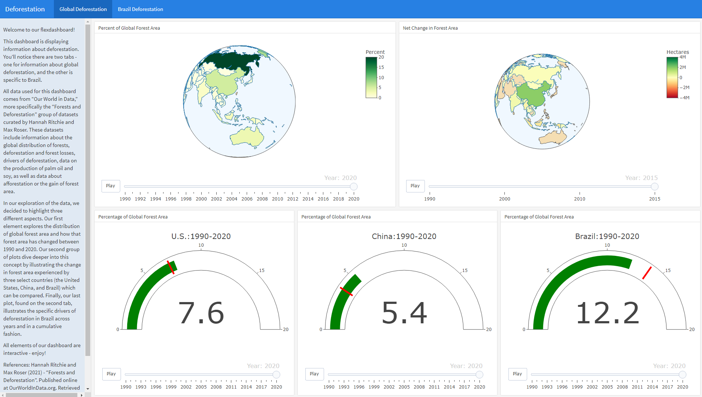
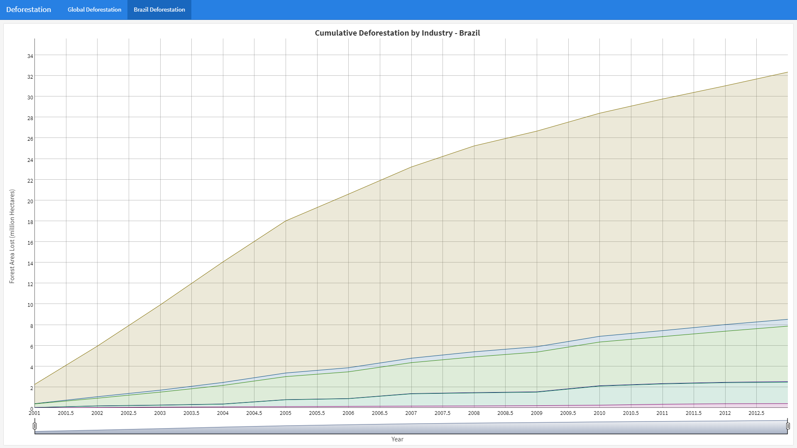

## ERHS 535 Final Project - Fall 2022

This repository contains a dashboard that was created as a final project for the R Programming for Research course at Colorado State University. The data for this project came from a Tidy Tuesday event focusing on deforestation and the dashboard was a collaboration between Will Finical, Wyatt Deaderick, and Ella Livesay.

Datasets for the dashboard can be found here:
https://github.com/rfordatascience/tidytuesday/blob/master/data/2021/2021-04-06/readme.md

